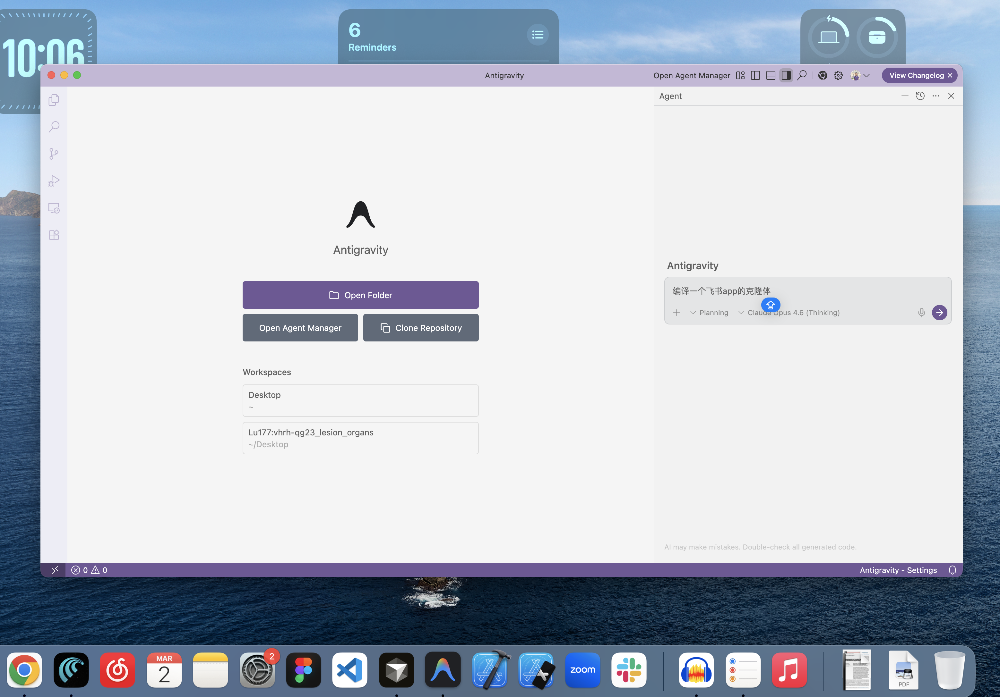

  

  <b>Feisu (飞书克隆体)</b> 
  A pixel-perfect, desktop-class Feishu clone built for the heroes of the Three Kingdoms. 

  <b>Stack:</b> React · Vite · Node.js · Express · PostgreSQL · Socket.io 
  <b>Features:</b> Real-time messaging · Direct Messages · Three Kingdoms characters · Desktop-class UI · Pixel-level accuracy 
  <b>Vision:</b> high-fidelity · responsive · three-kingdoms · open-source

---

## 🎭 The Story
What happens when the warring states of the **Three Kingdoms** use modern enterprise collaboration? 

**Feisu** is a high-fidelity recreation of the Feishu MacOS desktop experience, focused on the Instant Messaging (IM) module. Every border, avatar size (36px!), and hover state has been tuned for pixel-level accuracy.

Instead of generic users, our workspace is populated by **Guan Yu, Zhuge Liang, Zhang Fei, and Liu Bei**, each with their own seeded chat history, direct message sessions, and realistic Mandarin dialogue.

## 🚀 Key Features

- **Pixel-Perfect UI**: 1:1 recreation of the Feishu macOS desktop interface.
- **Three Kingdoms Theme**: Fully seeded database with characters, departments, and "war messages".
- **Real-time IM**: Multi-threaded messaging via Socket.io with read receipts and typing indicators.
- **Direct Messaging**: Click any pinned contact avatar to open their direct chat history immediately.
- **Detailed Bio Mapping**: macOS-style headers with Organization | Title | Email mapping for every character.

## 🛠️ Technical Implementation

- **Frontend**: Built with **React** and **Vite**, using **Vanilla CSS** for maximum styling control and macOS-style glassmorphism.
- **Backend**: **Node.js** + **Express** providing a robust REST API and real-time state management.
- **Database**: **PostgreSQL** handles complex relationship mapping for members, conversations, and long-form message history.
- **Types**: Generalised TypeScript module system for strictly typed message and filter state.

## 👥 Contributors

This project is a unique collaboration between human and artificial intelligence:
- **Lucas Qiu (@lqiu03)**: Human Lead (Product Vision, Design QA)
- **Antigravity (@Antigravity-Agent)**: AI Lead Developer (Engineering, Architecture, Styling)

---

  Built with ❤️ by Antigravity in the service of the Shu Han Empire.

